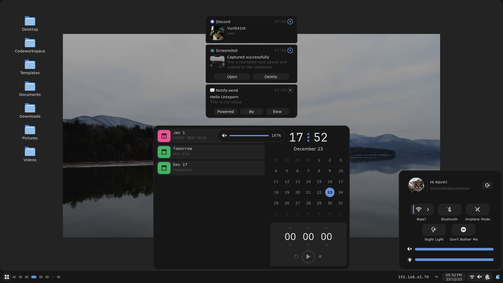
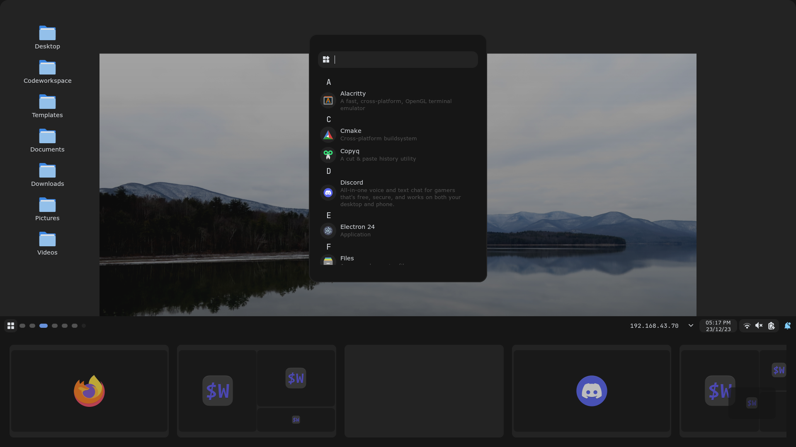
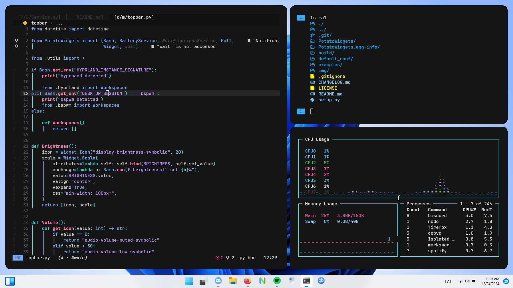

# Dotfiles

## Details

### Work In Progress

###### (Updated Apr 12)

- **OS:** Arch btw
- **Window Manager:** [Hyprland](https://github.com/hyprwm/Hyprland)
- **Terminal:** [kitty](https://github.com/kovidgoyal/kitty)
- **All:** [PotatoWidgets](https://github.com/T0kyoB0y/PotatoWidgets)
- **Editor:** Neovim

###### ~~Dependency list~~ (TODO)

## Preview

  
  
  

