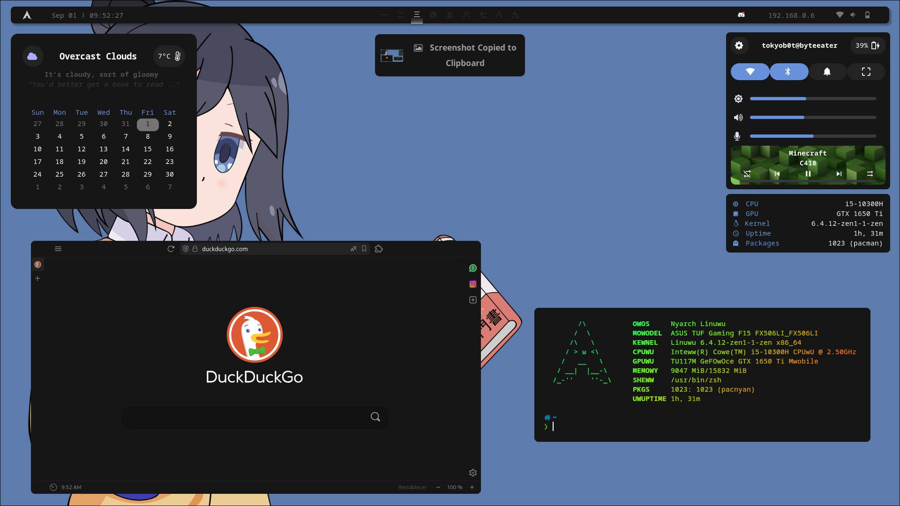

# Dotfiles

## Details

###### (Updated Sep 01)

- **OS:** Arch
- **Compositor:** Hyprland
- **Terminal:** kitty
- **TopBar:** Waybar
- **Widgets:** eww
- **Browser:** Vivaldi
- **Editor:** VSCode
  - **Theme:** [Another Colorscheme](https://marketplace.visualstudio.com/manage/publishers/t0kyob0y/extensions/another-colorscheme/hub?_a=acquisition)
  - **CSS:** You need to use [this](https://marketplace.visualstudio.com/items?itemName=be5invis.vscode-custom-css)
  - **Icons:** [Bearded Icons](https://marketplace.visualstudio.com/items?itemName=BeardedBear.beardedicons)
- **Scripts:** Some made by me, some not  

  

