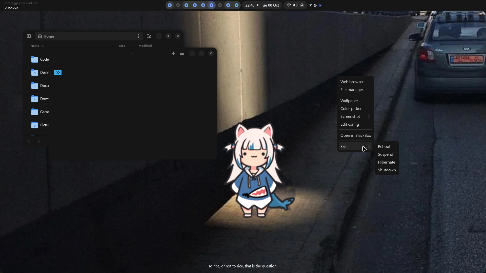

# Dotfiles

## Details  

###### (Updated Oct 24)  

- **OS:** Arch btw
- **Window Manager:** [BSPWM](https://github.com/baskerville/bspwm) & [bsp-layout](https://github.com/phenax/bsp-layout)
- **Compositor:** Picom Pijulius [Aur Fork](https://github.com/allusive-dev/picom-allusive)
- **Terminal:** [Kitty](https://github.com/kovidgoyal/kitty)
- **Widgets/Topbar/Notifications/All:** [eww](https://github.com/elkowar/eww)
- **Notifications:** [Tiramisu](https://github.com/Sweets/tiramisu)
- **Editor:** VSCodium  
  - **Theme:** [Another Colorscheme](https://marketplacwe.visualstudio.com/manage/publishers/t0kyob0y/extensions/another-colorscheme/hub?_a=acquisition)
  - **CSS:** You need to use [this](https://marketplace.visualstudio.com/items?itemName=be5invis.vscode-custom-css)
  - **Icons:** [Bearded Icons](https://marketplace.visualstudio.com/items?itemName=BeardedBear.beardedicons)
- **Scripts:** Some made by me, some not  

g
